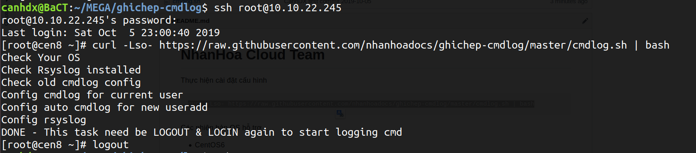
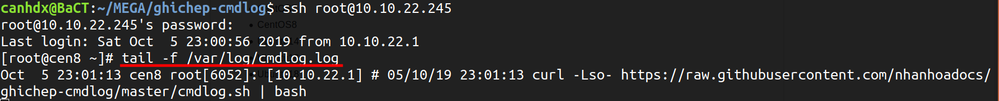

# Nhân Hòa Cloud Team 
Thực hiện cài đặt cấu hình
```sh 
curl -Lso- https://raw.githubusercontent.com/nhanhoadocs/ghichep-cmdlog/master/cmdlog.sh | bash
```

Hướng dẫn thao tác 


Logout và Login lại 


Các phiên bản OS hỗ trợ 
- CentOS6
- CentOS7 
- CentOS8 
- Ubuntu14
- Ubuntu16
- Ubuntu18 
- Ubuntu20

Hướng dẫn chi tiết: https://news.cloud365.vn/tools-log-all-command-of-user-in-linux/